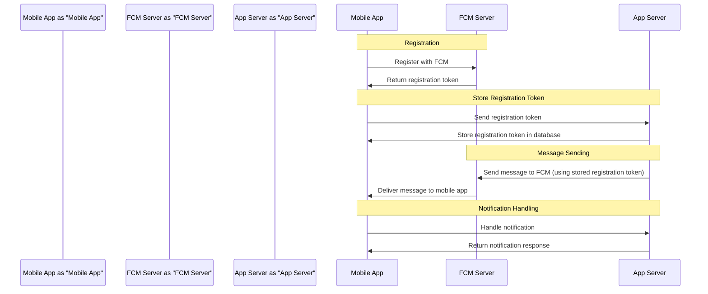
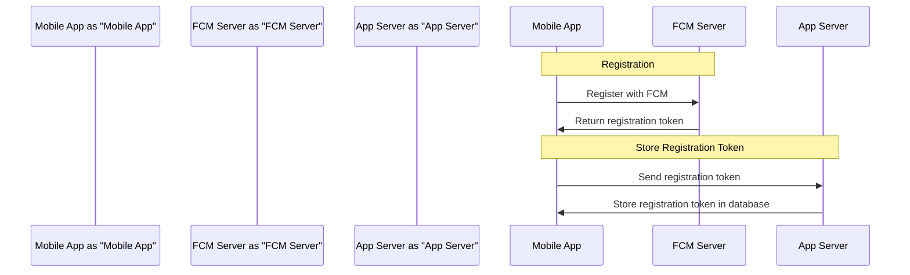
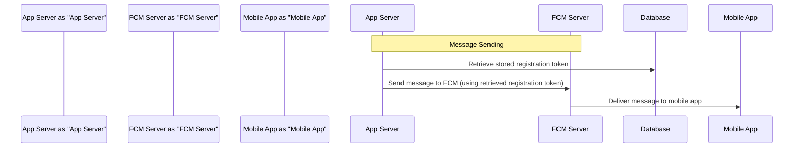

Here is the updated architecture/design document with the flow to store the registration token on the App server and consume the same while sending a message:


**FCM Architecture**

**Overview**

This document describes the architecture for integrating Firebase Cloud Messaging (FCM) into our mobile application. FCM is a cross-platform messaging solution that allows us to send targeted and personalized messages to our users across platforms.

**Components**

1. **FCM Server**: The FCM server is responsible for processing and delivering messages to our application.
2. **Application Server**: Our application server is responsible for sending messages to the FCM server, which then delivers them to our application.
3. **Mobile Application**: Our mobile application is responsible for registering with FCM, receiving messages, and handling notifications.

**Sequence Diagram**

Here is a high-level sequence diagram of the FCM architecture:

**Registration Flow**

Here is a detailed flowchart of the registration process:

**Message Sending Flow**

Here is a detailed flowchart of the message sending process:

**Design Considerations**

1. **Security**: We must ensure that our application handles FCM registration tokens securely, and that our application server only sends messages to authorized users.
2. **Scalability**: We must design our application to handle a large volume of messages, and to scale with our user base.
3. **Reliability**: We must design our application to handle failures and errors, and to ensure that messages are delivered reliably.

**Database Schema**

Here is a sample database schema to store the registration tokens:
```sql
CREATE TABLE registration_tokens (
  id INT PRIMARY KEY,
  user_id INT,
  registration_token VARCHAR(255),
  created_at TIMESTAMP DEFAULT CURRENT_TIMESTAMP,
  updated_at TIMESTAMP DEFAULT CURRENT_TIMESTAMP ON UPDATE CURRENT_TIMESTAMP
);
```
**Conclusion**

This document describes the architecture for integrating Firebase Cloud Messaging (FCM) into our mobile application. We have outlined the components, sequence diagram, registration flow, message sending flow, and design considerations for our FCM architecture. By following this architecture, we can ensure that our application provides a reliable and scalable messaging solution for our users.
